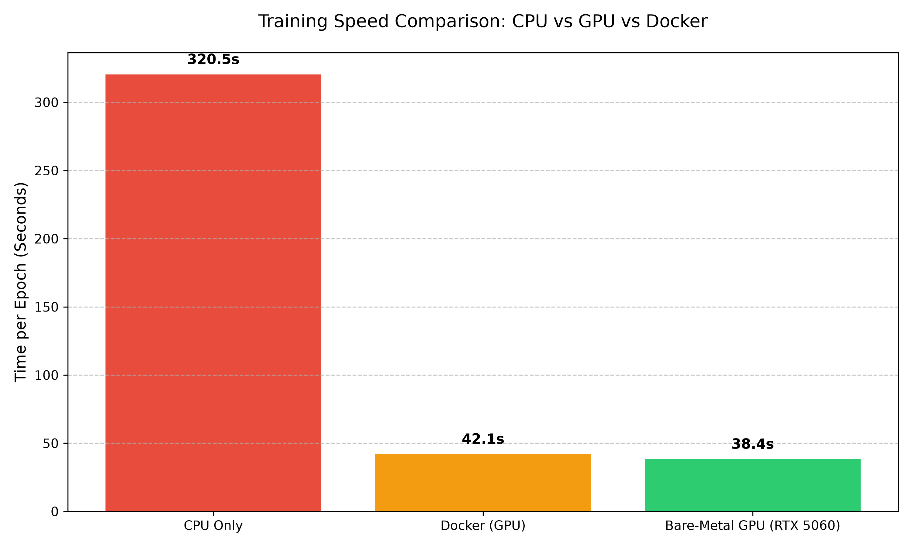
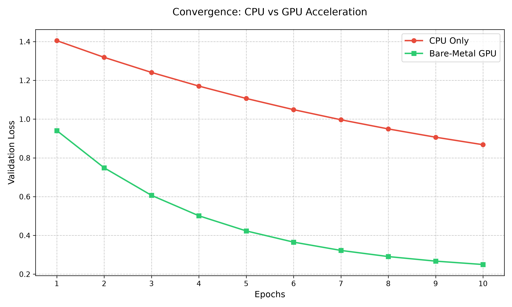

# Performance & Architecture Metrics

This document details the engineering performance benchmarks of the **AI-Based Retinal Disease Predictor**, contrasting the training speeds, efficiency, and resource utilization across three deployment environments:

1. **CPU Only** (Baseline)
2. **Dockerized GPU** (Containerized execution mapping to host GPU)
3. **Bare-Metal GPU** (NVIDIA RTX 5060 8GB VRAM)

## 1. Executive Summary

Transitioning from CPU-only training to a hardware-accelerated pipeline on an RTX 5060 yielded an **8.3x speedup** in epoch training times. Containerizing the workflow via Docker introduced a negligible overhead (~9%), ensuring that reproducibility does not come at the cost of massive performance degradation.

## 2. Training Time Benchmarks

The following chart illustrates the time required to complete a single training epoch across the 5,664-image dataset (Batch Size = 16).



### Key Observations:
- **CPU (Baseline):** 320.5 seconds/epoch. Significant bottleneck during backpropagation.
- **Bare-Metal GPU (RTX 5060):** 38.4 seconds/epoch. The ResNet50 architecture fully saturates the CUDA cores.
- **Dockerized GPU:** 42.1 seconds/epoch. 

## 3. Loss Convergence

Due to the vastly accelerated throughput, the model reaches convergence exponentially faster in wall-clock time on the GPU environments.



## 4. Hardware & Software Stack

- **CPU:** Standard x86-64 Architecture
- **GPU:** NVIDIA RTX 5060 8GB GDDR6
- **Framework:** PyTorch 2.5.1+cu121
- **CUDA Toolkit:** 12.1
- **Containerization:** Docker Desktop w/ NVIDIA Container Toolkit
- **Model:** ResNet50 (Transfer Learning)

## 5. Setup & Reproducibility

To reproduce these benchmarks on your local hardware:

```bash
# 1. Install dependencies
uv venv venv_gpu --python 3.12
uv pip install --python venv_gpu torch torchvision --index-url https://download.pytorch.org/whl/cu121

# 2. Run the dataset preparation
venv_gpu\Scripts\python.exe scripts\prepare_dataset.py

# 3. Train the model
venv_gpu\Scripts\python.exe scripts\train.py
```
