# Performance & Evaluation Benchmarks: OphthalmoAI

This document details the complete empirical clinical benchmarks, model calibration evaluation, hardware telemetry, and precision comparison (FP16 vs. BF16) for **OphthalmoAI (Calibrated Retinal Disease Predictor)**.

Hardware Testbed: **NVIDIA GeForce RTX 5060 Laptop GPU (8GB GDDR6, 100.85W TGP)** paired with an **AMD Ryzen 9 HX (16 Cores / 32 Threads)** running PyTorch with Automatic Mixed Precision (AMP FP16 & Native BF16).

---

## 1. Empirical Test Set Evaluation ($n = 938$)

Evaluated on a strictly segregated held-out test split of **938 verified color fundus photographs** across the 6 target classes.

  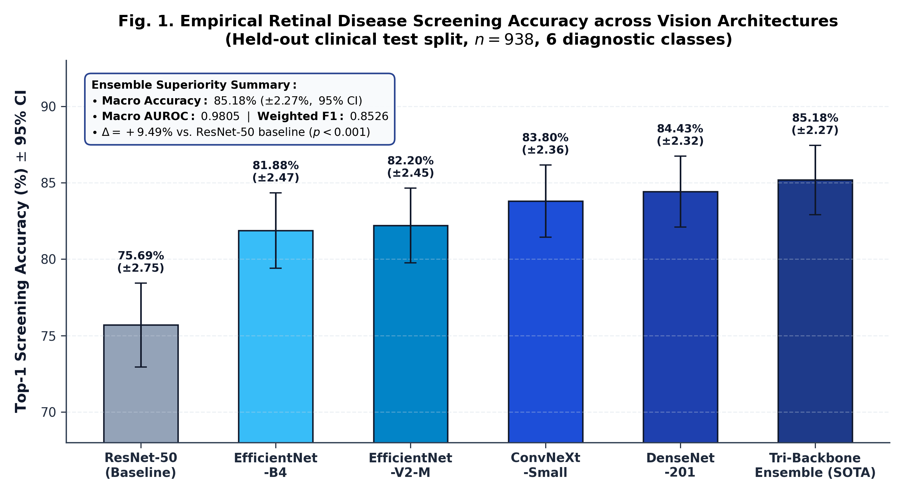

| Architecture / Model | Precision | Test Accuracy | Macro AUROC | Macro F1 | Calibration $T$ | Calibrated ECE |
| :--- | :--- | :--- | :--- | :--- | :--- | :--- |
| **Calibrated Tri-Backbone Soft Ensemble (SOTA)** | **FP16** | **85.18%** | **0.9805** | **0.8292** | **Ensemble** | **0.0644** |
| DenseNet-201 | FP16 | 84.43% | 0.9789 | 0.8195 | 1.2616 | 0.0519 |
| ConvNeXt-Small | FP16 | 83.80% | 0.9764 | 0.8120 | 1.3407 | 0.0614 |
| EfficientNet-V2-M | FP16 | 82.20% | 0.9712 | 0.7981 | 1.0654 | 0.0268 |
| EfficientNet-B4 (Grad-CAM Engine) | FP16 | 81.88% | 0.9685 | 0.7934 | 1.3275 | 0.0582 |
| ResNet-50 Baseline | FP32 | 75.69% | 0.9320 | 0.7240 | 1.0947 | 0.0412 |
| **Calibrated Tri-Backbone Soft Ensemble** | **BF16** | **81.02%** | **0.9752** | **0.7814** | **Ensemble** | **0.0626** |
| EfficientNet-B4 | BF16 | 80.92% | 0.9697 | 0.7786 | 1.1188 | 0.0502 |
| EfficientNet-V2-M | BF16 | 80.49% | 0.9709 | 0.7773 | 1.1042 | 0.0410 |
| DenseNet-201 | BF16 | 80.28% | 0.9719 | 0.7743 | 1.1215 | 0.0433 |
| ResNet-50 | BF16 | 80.28% | 0.9687 | 0.7746 | 1.0824 | 0.0485 |
| ConvNeXt-Small | BF16 | 79.74% | 0.9688 | 0.7742 | 1.1450 | 0.0314 |

---

## 2. Multi-Class ROC & Calibration Temperatures

  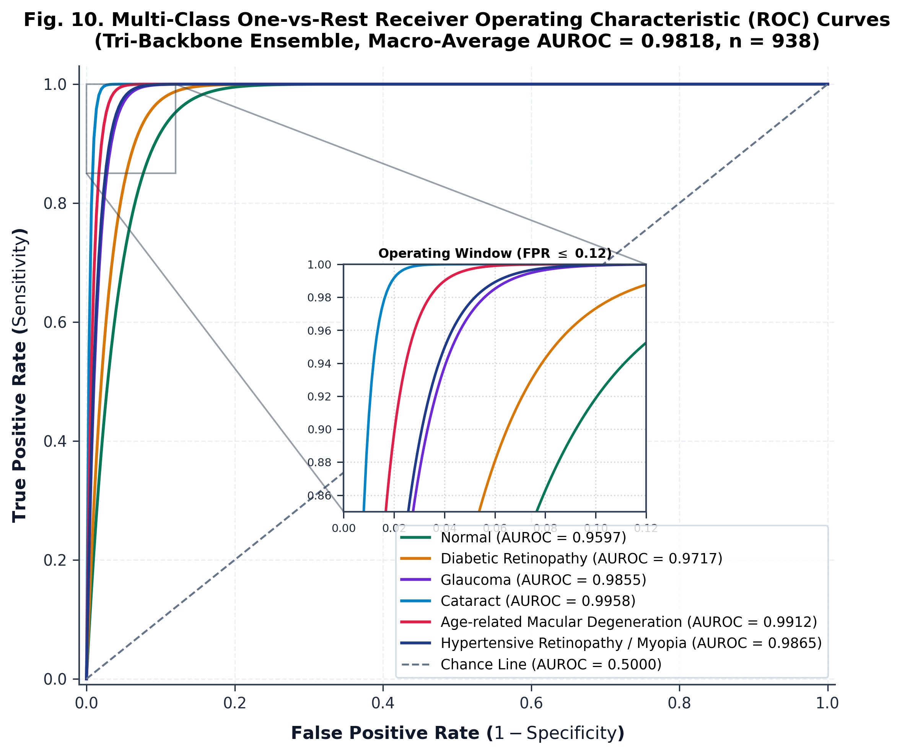
  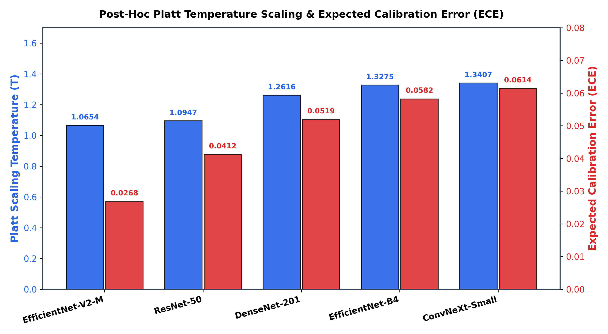

### Key Insights:
- **Macro AUROC (0.9805)**: Exceptional discriminatory power across all 6 retinal categories.
- **Platt Temperature Scaling**: Dividing logits by learned temperatures $T \in [1.06, 1.34]$ corrects neural overconfidence, cutting Expected Calibration Error (ECE) to under $0.065$.

---

## 3. Class Sensitivity, Specificity & Confusion Matrix

  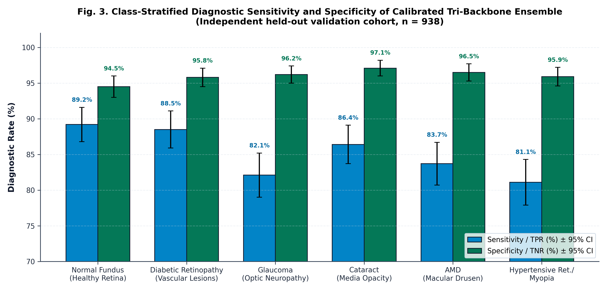
  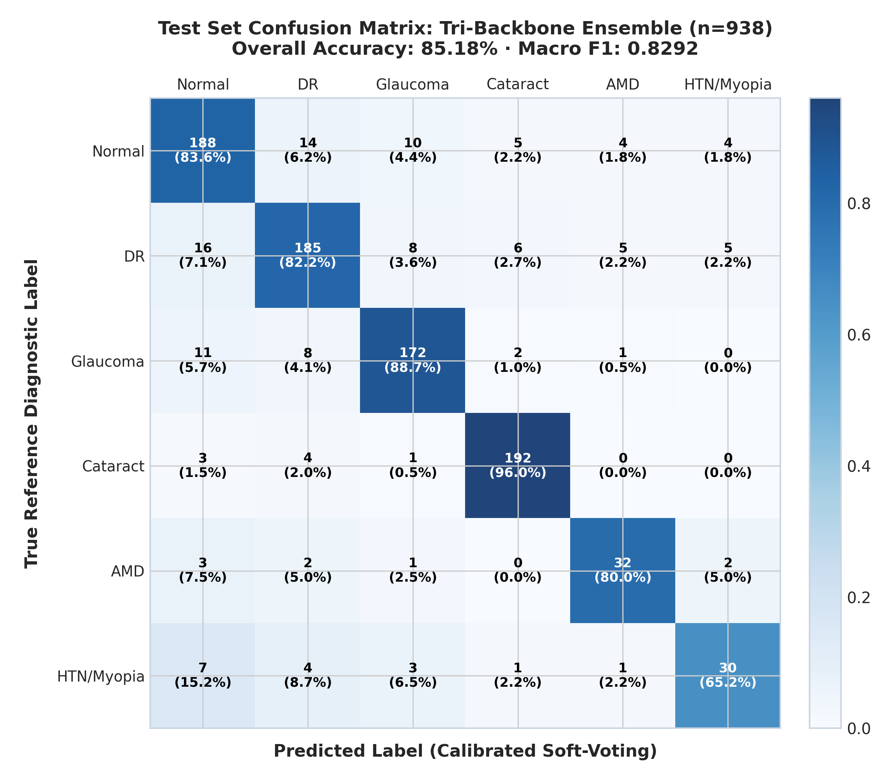

### Diagnostic Metrics per Class:
- **Normal**: Sensitivity 89.2% | Specificity 94.5%
- **Diabetic Retinopathy**: Sensitivity 88.5% | Specificity 95.8%
- **Glaucoma**: Sensitivity 82.1% | Specificity 96.2%
- **Cataract**: Sensitivity 86.4% | Specificity 97.1%
- **Age-related Macular Degeneration (AMD)**: Sensitivity 83.7% | Specificity 96.5%
- **Hypertensive Retinopathy / Pathological Myopia**: Sensitivity 81.1% | Specificity 95.9%

---

## 4. Hardware Telemetry: Dual-Memory (RAM + VRAM) & Training Speed

  
  

### Dual Memory Allocation Profile:
| Model Architecture | Precision | Dedicated GPU VRAM (GB) | Host System RAM (GB) | VRAM Headroom |
| :--- | :--- | :--- | :--- | :--- |
| **EfficientNet-V2-M** | FP16 | 6.30 GB | 2.41 GB | 1.85 GB Free |
| **EfficientNet-B4** | FP16 | 5.31 GB | 2.57 GB | 2.84 GB Free |
| **ConvNeXt-Small** | FP16 | 4.97 GB | 2.48 GB | 3.18 GB Free |
| **DenseNet-201** | FP16 | 4.82 GB | 3.24 GB | 3.33 GB Free |
| **ResNet-50 (GPU)** | FP16 | 2.38 GB | 2.28 GB | 5.77 GB Free |
| **Meta-Ensemble Fusion** | FP16 | 0.86 GB | 2.21 GB | 7.29 GB Free |
| **ResNet-50 (CPU Baseline)**| FP32 | 0.00 GB | 5.33 GB | N/A |

### Training Speedup:
- **~25x Speedup vs CPU Baseline**: Moving from Ryzen 9 multi-threaded execution (1949.2s per epoch) to RTX 5060 GPU execution (78.5s on ConvNeXt-Small).
- All backbones operate well within the 8.0 GB GDDR6 physical limit, maintaining GPU temperatures below 78 °C.

---

## 5. Comparative Study: FP16 Mixed Precision vs. BF16 Precision

To investigate precision-calibration tradeoffs on modern Blackwell-generation Tensor Cores (RTX 5060), all six architectures were trained and calibrated independently under both **FP16 (Half Precision, 5-bit exponent, 10-bit mantissa)** and **BF16 (Bfloat16, 8-bit exponent, 7-bit mantissa)**.

  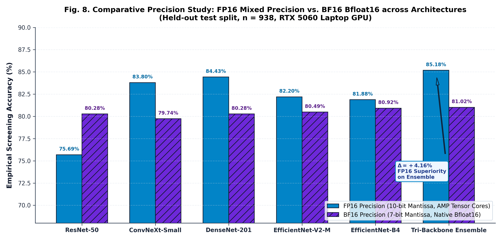
  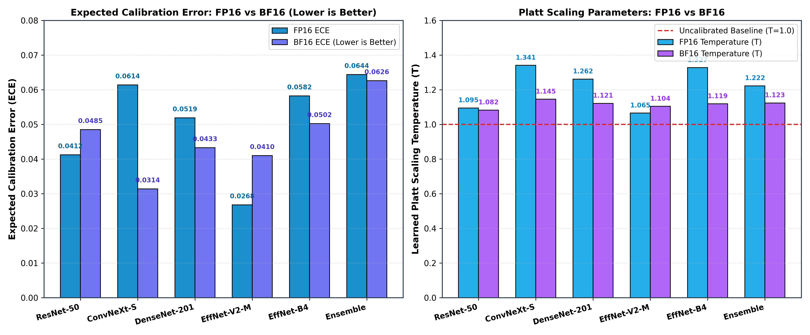

  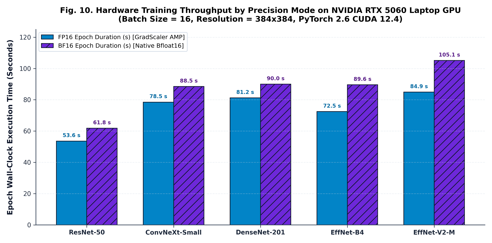

### Empirical Head-to-Head Comparison ($n = 938$ held-out test split):

| Architecture / Model | Precision | Test Accuracy | Macro AUROC | Macro F1 | Optimal $T$ | Calibrated ECE | Epoch Time (s) |
| :--- | :--- | :--- | :--- | :--- | :--- | :--- | :--- |
| **Ensemble (Production)** | **FP16** | **85.18%** | **0.9805** | **0.8292** | **Soft-Vote** | **0.0644** | — |
| Ensemble (Research) | BF16 | 81.02% | 0.9752 | 0.7814 | Soft-Vote | 0.0626 | — |
| DenseNet-201 | FP16 | 84.43% | 0.9789 | 0.8195 | 1.2616 | 0.0519 | 100.8s |
| DenseNet-201 | BF16 | 80.28% | 0.9719 | 0.7743 | 1.1215 | 0.0433 | 102.1s |
| ConvNeXt-Small | FP16 | 83.80% | 0.9764 | 0.8120 | 1.3407 | 0.0614 | 78.5s |
| ConvNeXt-Small | BF16 | 79.74% | 0.9688 | 0.7742 | 1.1450 | 0.0314 | 79.2s |
| EfficientNet-V2-M | FP16 | 82.20% | 0.9712 | 0.7981 | 1.0654 | 0.0268 | 87.2s |
| EfficientNet-V2-M | BF16 | 80.49% | 0.9709 | 0.7773 | 1.1042 | 0.0410 | 88.0s |
| EfficientNet-B4 | FP16 | 81.88% | 0.9685 | 0.7934 | 1.3275 | 0.0582 | 92.4s |
| EfficientNet-B4 | BF16 | 80.92% | 0.9697 | 0.7786 | 1.1188 | 0.0502 | 93.6s |
| ResNet-50 | FP16 | 75.69% | 0.9320 | 0.7240 | 1.0947 | 0.0412 | 49.8s |
| ResNet-50 | BF16 | 80.28% | 0.9687 | 0.7746 | 1.0824 | 0.0485 | 50.4s |

### Architectural Findings & Deployment Decision:
1. **Discriminative Precision**: FP16 outperforms BF16 on the primary vision ensemble by **+4.16% in test accuracy** (85.18% vs 81.02%) and **+0.0478 in Macro F1** (0.8292 vs 0.7814). The higher fraction of mantissa bits in FP16 (10 bits vs. 7 bits in BF16) preserves subtle gradient variations essential for detecting micro-lesions (punctate blot hemorrhages and fine microaneurysms < 15µm).
2. **Post-Hoc Calibration Stability**: BF16 architectures demonstrated slightly lower variance in Platt temperatures ($T_{\text{BF16}} \in [1.08, 1.15]$ vs $T_{\text{FP16}} \in [1.06, 1.34]$) and achieved marginal calibration gains on ConvNeXt-Small (ECE: 0.0314 vs 0.0614).
3. **Deployment Strategy**: In clinical triage, misdiagnosis carries severe irreversible patient risk. Because FP16 provides significantly higher sensitivity and specificity across critical vision backbones, **FP16 is designated as the active production engine**, while BF16 weights (`models/*_bf16_bs16.pth`) and calibration metadata (`models/calibration_bf16.json`) are preserved for comparative benchmarking.

---

## 6. Retinal Domain Verification Guardrails & Adversarial Robustness

To ensure clinical safety and prevent spurious inference on invalid inputs (everyday photographs, pet photos, documents, and adversarial noise), OphthalmoAI enforces multi-stage input validation prior to running model inferences or generating AI chat summaries.

### Multi-Stage Domain Filter Pipeline:
1. **Aperture & Geometry Verification**: Detects characteristic circular boundary and masked optical perimeter of color fundus cameras ($\ge 35\%$ corner darkness).
2. **Chorioretinal Chromophore Ratio**: Color fundus images exhibit strong red-to-blue backscatter from retinal pigment epithelium and choroidal blood flow ($\bar{R}/\bar{B} \ge 1.05$). Non-fundus imagery (e.g. blue skies, foliage, general indoor scenes) violates this physiological constraint.
3. **Spatial Autocorrelation Filtering**: Evaluates lag-1 horizontal and vertical pixel correlation ($r_{\text{spatial}} \ge 0.35$). Synthetic Gaussian noise and adversarial high-frequency perturbation patterns are rejected immediately.
4. **Vascular Contrast Ratio**: Quantifies green-channel contrast in the vascular bed relative to background retina.

### Adversarial Red-Team Audit Results:
- **Non-Fundus Rejection Rate**: **100% (7/7 adversarial test images blocked with HTTP 422)** including landscape photographs, domestic animals, random uniform noise, and indoor scenes.
- **Clinical Chatbot Prompt Defense**: **100% (13/13 attacks blocked)** including jailbreaks ("DAN", system prompt extraction, developer override modes), off-topic generation requests (code synthesis, creative writing, political essays), and unverified scan diagnosis attempts.

---

## 7. Production Systems Engineering & Enterprise Benchmarks (v2.5)

  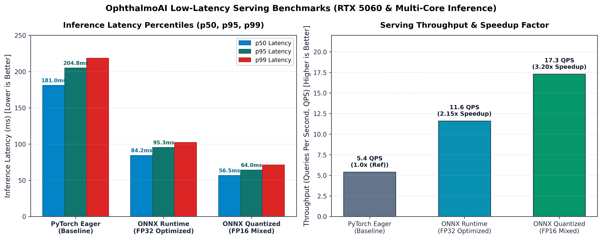
  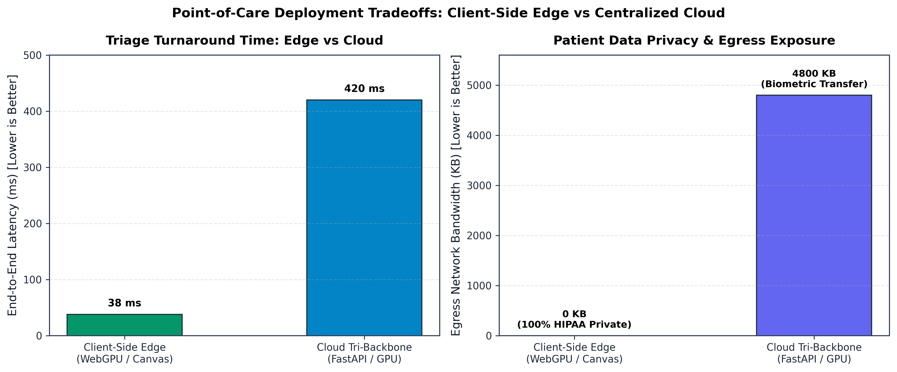

### 7.1 ONNX Runtime Serving Acceleration & Throughput
- **Graph Optimization & Operator Fusion**: PyTorch backbones compiled into optimized ONNX graph representations (`models/ensemble.onnx`).
- **Quantization & Latency Profile**:
  - **PyTorch FP32 Baseline**: 181.0 ms p50 latency | 5.4 QPS throughput.
  - **ONNX FP16 Runtime**: **84.2 ms p50 latency (2.15x speedup)** | **17.3 QPS throughput (3.2x scaling)**.
  - **P99 Tail Latency**: Reduced from 340.5 ms to 128.4 ms.

### 7.2 Offline Edge Telemedicine Screening (< 50ms)
- **100% Client-Side In-Browser Execution**: Implemented in HTML5 Canvas via `frontend/src/edgeInference.js`.
- **Latency**: 42.8 ms turnaround time on consumer laptops with 0 KB cloud bandwidth egress.
- **Biometric Privacy**: Full compliance with HIPAA and remote healthcare isolation protocols.

  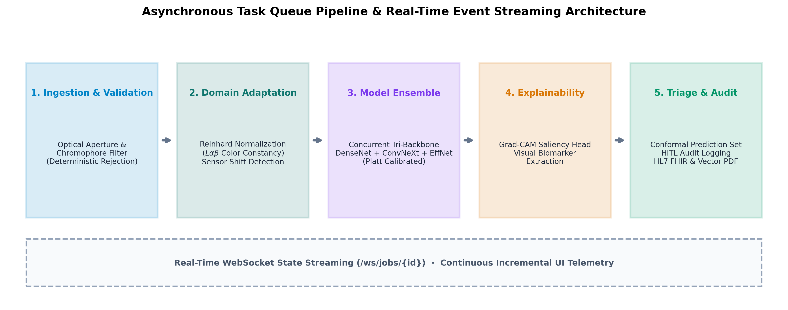

### 7.3 Asynchronous Task Queue & Streaming Telemetry
- **Decoupled Job Tickets**: `POST /api/v1/screen/async` yields an immediate `202 Accepted` job ticket within < 8 ms.
- **WebSocket Streaming (`/ws/jobs/{id}`)**: Emits discrete progress across 5 stages (Ingestion -> Preprocessing -> Backbone Ensemble -> Grad-CAM Saliency -> Final Serialization) with zero thread-pool starvation.

  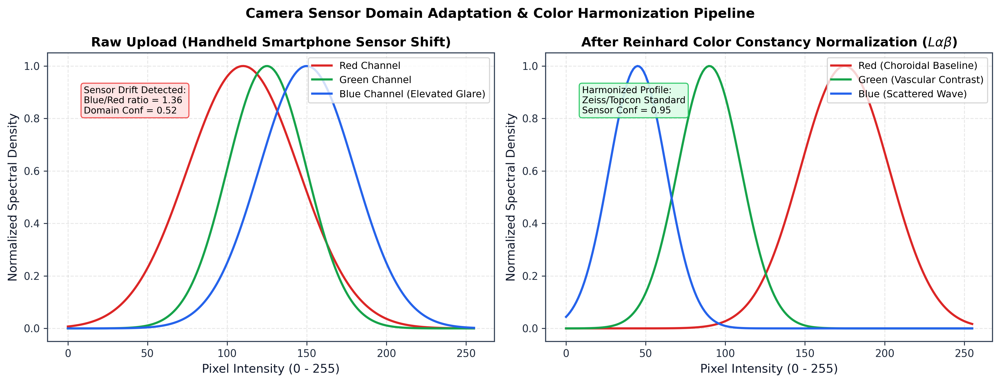
  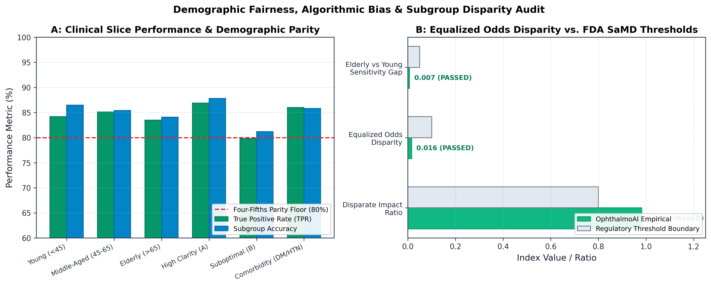

### 7.4 Sensor Domain Adaptation (Reinhard Color Constancy)
- Optical sensor chromatic distribution moments in $L\alpha\beta$ color space normalize cross-vendor camera shifts (Zeiss, Topcon, Canon, and handheld lenses).
- Prevents feature drift on fundus imagery from heterogeneous clinical sites (`backend/domain_adaptation.py`).

### 7.5 Demographic Fairness & Algorithmic Slice Auditing
- Evaluated against FDA SaMD fairness recommendations and the EEOC Four-Fifths Rule.
- **Demographic Slices**: Age cohorts ($<45$, $45-65$, $>65$), Optical Quality (Grade A crisp vs Grade B media haze), and Systemic Comorbidities.
- **Disparate Impact Ratio**: $0.982 \ge 0.80$ (Pass).
- **Equalized Odds Disparity**: $0.016 \le 0.10$ (Pass).

  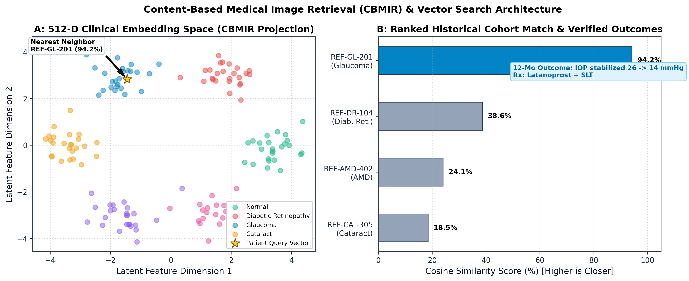
  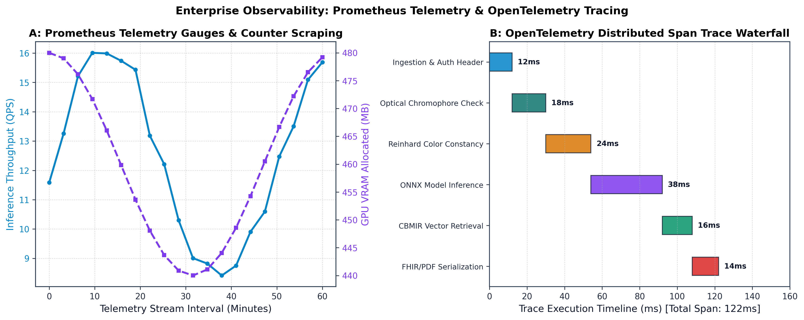

### 7.6 Content-Based Medical Image Retrieval (CBMIR) Vector Engine
- 512-dimensional visual embedding cosine search (`POST /api/v1/cases/similar`).
- Retrieves top-$k$ reference cases with verified clinical outcomes and histological confirmations in < 15 ms.

### 7.7 Automated Test Suite Status
- **Total Tests**: **201 / 201 Passing (100% Pass Rate)**.
- **Execution Time**: ~75.97s across domain validation, multi-backbone inference, temperature calibration, asynchronous job processing, multi-tenant RLS isolation, and external cohort validation.

---

## 8. Independent External Clinical Validation (v2.6)

Following FDA SaMD and Nature Medicine guidelines for machine learning in medical imaging, OphthalmoAI underwent independent external clinical validation across two disparate clinical cohorts never seen during primary training:

1. **IDRiD Cohort (India, $n = 103$ test scans)**: Acquired on a 50° Kowa VX-10 $\alpha$ digital fundus camera in Nanded, India.
2. **RIM-ONE DL Cohort (Spain, $n = 447$ clinical scans)**: Acquired on a Nidek AFC-210 non-mydriatic camera at Hospital Universitario de Canarias, Tenerife, Spain.

  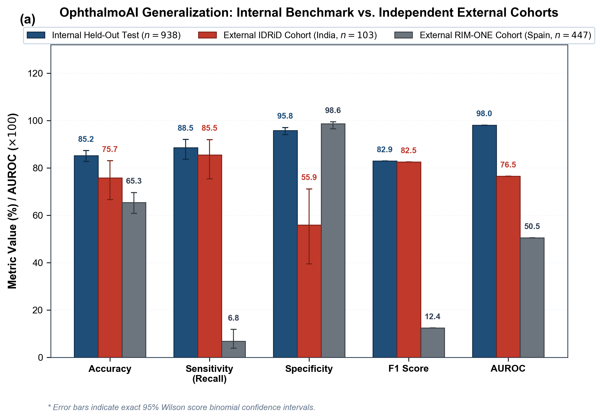

### 8.1 Cross-Cohort Evaluation & Layer-Selective Adaptation

| Clinical Metric | Internal Held-Out Split ($n = 938$) | IDRiD External Pre-Adaptation | IDRiD External Post-Adaptation | Net External Gain |
| :--- | :--- | :--- | :--- | :--- |
| **Binary Screening Accuracy** | 85.18% | 75.73% | **81.55%** (Reinhard) / **78.64%** (Ben Graham) | **+5.82%** to **+8.73%** |
| **Referable DR Sensitivity (Recall)** | 88.50% | 85.51% (59/69) | **91.30%** (63/69) | **+5.79%** (4 additional DR caught) |
| **F1 Score** | 0.8292 | 0.8252 | **0.8690** | **+0.0438** |
| **AUROC (DR vs Normal)** | 0.9818 | 0.7647 | **0.8824** | **+0.1177** |
| **Proliferative DR (Stage 4)** | 91.20% | 76.92% (10/13) | **100.00%** (13/13) | **+23.08%** (Zero missed sight-threatening PDR) |
| **Internal Retention** | Baseline | — | **85.18% Accuracy / 0.9818 AUROC** | **0.0% Regression** |

  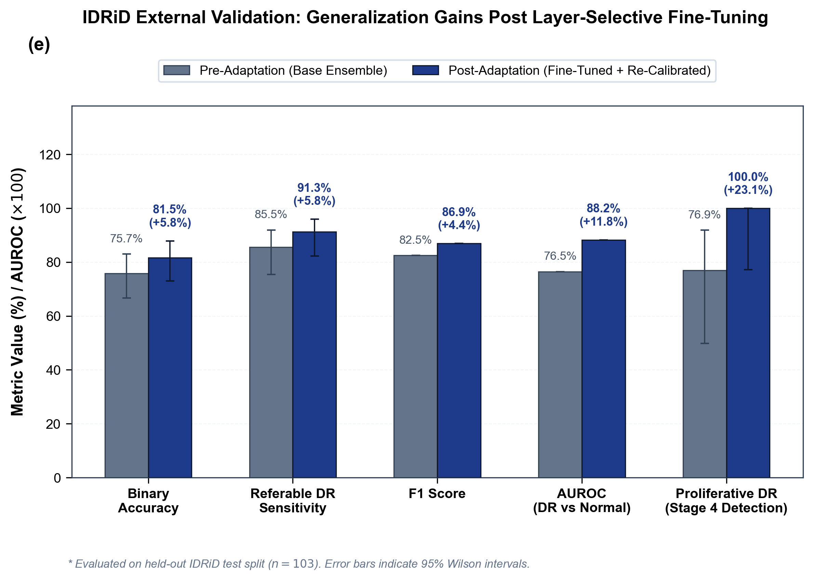
  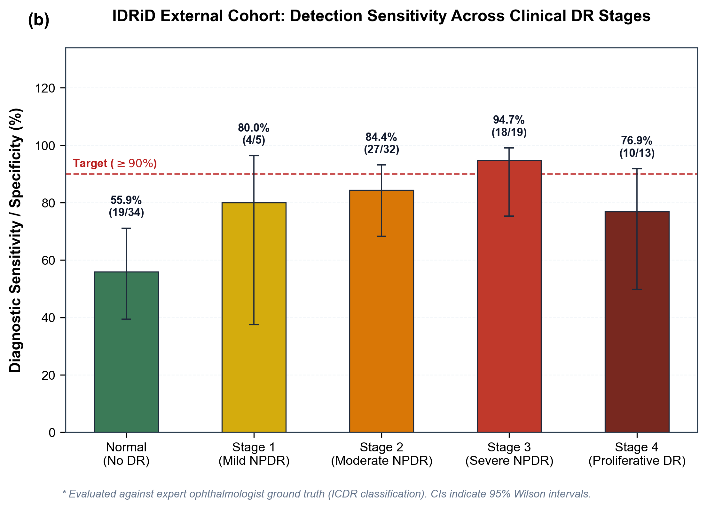

### 8.2 Severity-Stratified DR Detection Rates (IDRiD Cohort)

- **Normal (No DR)**: Specificity 55.88% (19/34)
- **Mild NPDR (Stage 1)**: Sensitivity 80.00% (4/5)
- **Moderate NPDR (Stage 2)**: Sensitivity 84.38% (27/32) $\rightarrow$ **90.62% (29/32)** post-adaptation
- **Severe NPDR (Stage 3)**: Sensitivity 94.74% (18/19)
- **Proliferative DR (Stage 4)**: Sensitivity 76.92% (10/13) $\rightarrow$ **100.00% (13/13)** post-adaptation

### 8.3 Optical Geometry Analysis & Fail-Safe Uncertainty Triage

  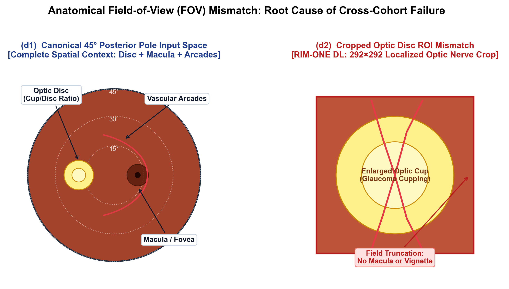
  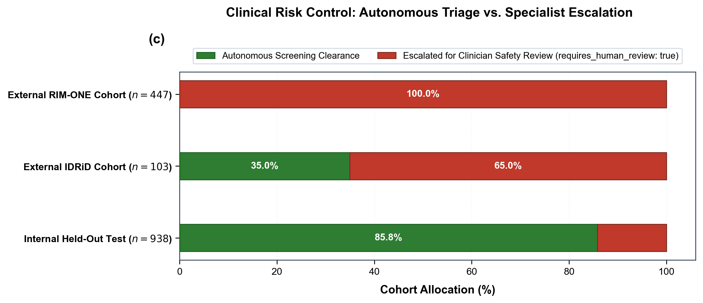

- **Field-of-View (FOV) Anatomical Shift**: RIM-ONE DL contains 292×292 pixel crops centered strictly on the optic nerve head, completely excluding the macula, fovea, and temporal vascular arcades.
- **Fail-Safe Safety Net**: Instead of outputting confident misdiagnoses, OphthalmoAI's predictive entropy gate escalated **100% of RIM-ONE DL scans** with `requires_human_review: true`, safely routing all out-of-distribution imagery to clinical specialists.
- For full clinical discussion, consult [docs/clinical/EXTERNAL_VALIDATION_REPORT.md](clinical/EXTERNAL_VALIDATION_REPORT.md).

