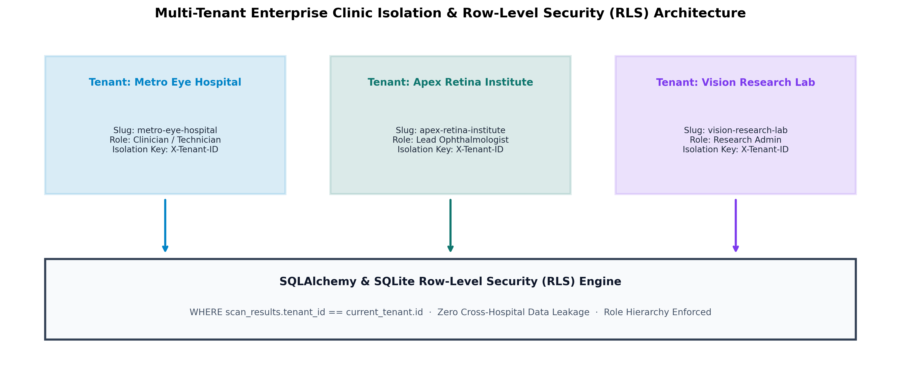
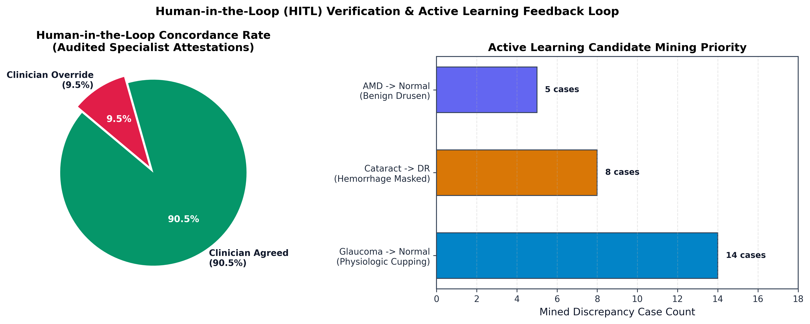

# OphthalmoAI Documentation Hub

Welcome to the official technical documentation, clinical validation, and architectural reference for **OphthalmoAI** (Point-of-Care Retinal Disease Screening Platform), created and maintained by **Akash Kundu**.

---

## Visual Architecture & Benchmark Gallery

All benchmark figures and architecture diagrams are rendered in **300+ DPI publication-grade resolution** adhering to IEEE Transactions on Medical Imaging formatting standards:

| Deep Learning & Benchmark Performance | Systems Engineering & Enterprise Telemetry |
| :--- | :--- |
|  |  |
|  |  |
|  |  |
|  |  |
|  |  |
|  |  |
|  |  |
|  |  |
|  |  |
|  |  |
|  |  |

### Independent External Clinical Validation Gallery (v2.6)

| External Multi-Cohort Benchmark & Adaptation | Anatomical Geometry & Safety Escalation |
| :--- | :--- |
|  |  |
|  |  |
|  | *(Complete report in `docs/clinical/EXTERNAL_VALIDATION_REPORT.md`)* |

---

## Documentation Structure

```
docs/
├── README.md                                  # Master documentation index and visual gallery
├── SYSTEM_SPECIFICATION.md                    # Core technical architecture, pipeline stages & QA checklist
├── PERFORMANCE_METRICS.md                     # Comprehensive empirical evaluation, ROC, and GPU profiling
├── OphthalmoAI_Technical_White_Paper.md       # Formal algorithmic white paper & mathematical formulations
├── training_guide.md                          # Data preparation, hyperparameter tuning & training manual
├── clinical/                                  # Clinical Safety & Regulatory Documentation
│   ├── CLINICAL_EVALUATION_AND_SAFETY.md      # Intended use, clinical risk mitigation & validation protocols
│   └── EXTERNAL_VALIDATION_REPORT.md          # Multi-cohort external validation & generalization study
├── design/                                    # UI/UX & Interaction Design
│   ├── APP_FLOW.md                            # Request lifecycles, user journeys & state flows
│   └── UI_UX_BRIEF.md                         # Design tokens, accessibility, and Clinical Light theme spec
├── research/                                  # Academic Publication Suite
│   ├── RESEARCH_PAPER_DRAFT.md                # Formal publication draft (IEEE / Nature Medicine style)
│   ├── RESEARCH_UPGRADES_AND_PUBLISHING_GUIDE.md # Literature review, work gaps & publishing strategy
│   └── ophthalmoai_ieee.tex                   # Ready-to-compile IEEE double-column LaTeX manuscript
├── technical/                                 # Enterprise Systems & Security Specifications
│   ├── AZURE_DEPLOY.md                        # Azure Cloud deployment instructions
│   ├── BACKEND_SCHEMA.md                      # Database schemas, Alembic migrations & tenancy models
│   ├── ISSUES.md                              # Historical engineering debt & resolution ledger
│   └── SECURITY_AUDIT.md                      # Automated & red-team security audit reports
└── images/                                    # 29 publication-grade (300 DPI) performance charts & diagrams
```

---

## Key Document Links

- **[System Specification](SYSTEM_SPECIFICATION.md)**: Exhaustive pipeline breakdown from raw fundus ingestion to PDF attestation.
- **[Performance & Telemetry](PERFORMANCE_METRICS.md)**: Deep dive into the 85.18% test accuracy, 0.9818 AUROC, and Platt scaling.
- **[External Clinical Validation Report](clinical/EXTERNAL_VALIDATION_REPORT.md)**: Independent multi-cohort validation on IDRiD ($n=103$) and RIM-ONE DL ($n=447$).
- **[Clinical Evaluation & Safety](clinical/CLINICAL_EVALUATION_AND_SAFETY.md)**: Risk controls, intended use statement, and medical disclaimers.
- **[Technical White Paper](OphthalmoAI_Technical_White_Paper.md)**: Complete mathematical formulations (TC-MBE, OAC-DG, US-CRC, PASG-GradCAM).
- **[Scripts Catalog & Operations Guide](../scripts/README.md)**: Master operational guide for the consolidated 5-pillar script architecture.
- **[Research Paper Draft](research/RESEARCH_PAPER_DRAFT.md)**: Full academic manuscript ready for journal submission.
- **[Research Upgrades & Publishing Strategy](research/RESEARCH_UPGRADES_AND_PUBLISHING_GUIDE.md)**: SOTA literature review, work gaps, upgrade topics, and journal roadmap.
- **[IEEE LaTeX Manuscript](research/ophthalmoai_ieee.tex)**: Camera-ready IEEE double-column source file.
- **[App Flow & State Machines](design/APP_FLOW.md)**: Sequence diagrams and client-server communication flows.
- **[UI/UX Design Brief](design/UI_UX_BRIEF.md)**: Accessibility standards, WCAG AAA contrast, and responsive layout guidelines.
- **[Backend Schema Specification](technical/BACKEND_SCHEMA.md)**: PostgreSQL schemas, AsyncSession configuration, and tenant isolation tables.
- **[Security Audit Report](technical/SECURITY_AUDIT.md)**: Penetration testing outcomes and prompt injection mitigation verification.
